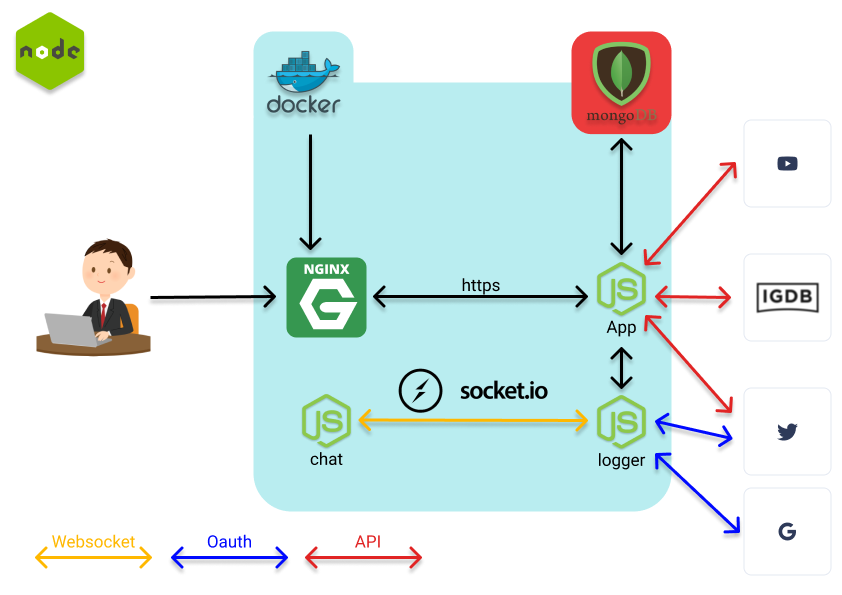

# Reti Di Calcolatori 2021
<p align="center">
  
</p>

# Descrizione
Progetto per il corso 2020/21 di Reti di Calcolatori, tenuto dal prof. Andrea Vitaletti presso La Sapienza Università di Roma

## Informazioni
GamerVerse è una piattaforma dedicata a coloro che vogliono avvicinarsi o approfondire il mondo dei videogiochi. Grazie alla sua semplicità, è possibile cercare informazioni su qualsiasi gioco, ottenendo varie informazioni al riguardo, tra cui trama, tweets e trailer. È possibile registrarsi sul nostro sito per entrare in contatto con una grande community e condividere le proprie opinioni con altri giocatori.

## Requisiti
I requisiti per la corretta consegna del progetto sono:
- Il servizio REST che implementate (lo chiameremo SERV) deve offrire all'esterno delle API documentate con swagger per esempio
- SERV si deve interfacciare con almeno due servizi REST “esterni”, cioè non su localhost (e.g. google maps)
- Almeno uno dei servizi REST esterni deve essere “commerciale” (es: twitter, google, facebook, pubnub, parse, firbase etc)
- Almeno uno dei servizi REST esterni deve richiedere oauth (e.g. google calendar)
- Si devono usare Websocket e/o AMQP (o simili es MQTT)
- Il progetto deve essere su GIT (GITHUB, GITLAB...) e documentato don un README che illustri almeno scopo del progetto, tecnologie usate, come installarlo, come far girare i casi di test
- Le API REST implementate in SERV devono essere documentate su GIT e devono essere validate con un caso di test

## Tecnologie
* Docker
* NGINX
* API Twitter
* API Google
* API IGDB
* API YouTube
* Node.js (Express, Passport..)
* WebSocket
* OpenSSL
* OAuth2
* MongoDB

## Schema
<p align="center">
  
</p>


## Prerequisiti per il corretto funzionamento
1. Node.js & NPM (Node Package Manager) https://nodejs.org/it/
2. Docker https://docs.docker.com/get-docker/
3. Docker Engine versione 20.10.7
4. Docker Compose versione 1.27.4 (o superiore)

## Avvio (Linux)
1. Occorre scaricare la cartella sulla propria macchina, utilizzando il comando ```git clone https://github.com/SpartanDave097/RetiCalcolatori2021.git``` da terminale
2. Nel terminale, eseguire il comando ```sudo docker build gamerverse -t .```
3. Rimanendo nel terminale, digitare ```sudo docker-compose up -d``` (se si utilizza Windows lanciare Docker prima di questo comando)
4. Aprire un browser su https://localhost
5. Se si vuole chiudere il sito, inserire il comando ```sudo docker-compose down```
6. Buona navigazione!

Inizialmente il browser emetterà un avviso di ritorno nell'area protetta: questo perchè chiave e certificato di sicurezza del sito non sono verificate dalla CA (Certification Authority); ignorare l'avviso e procedere verso il sito.

## API reference
API utilizzata all'interno del progetto:
- [IGDB](https://api-docs.igdb.com/#about): Database di videogiochi su larga scala
- [YouTube](https://developers.google.com/youtube/v3)

# Documentazione API

## Games Home

- URL: /
- Metodo: 'POST'
- Parametri Url: 'Games' = string
- Risposta con successo
- Code 200 -> OK

* Content { { "id": 25076, "aggregated_rating": 94.0588235294118, "cover": { "id": 80403, "height": 800, "image_id": "co1q1f" }, "first_release_date": 1540512000, "genres": [ { "id": 5, "name": "Shooter" }, { "id": 12, "name": "Role-playing (RPG)" }, { "id": 31, "name": "Adventure" } ], "name": "Red Dead Redemption 2", "platforms": [ { "id": 6, "name": "PC (Microsoft Windows)" }, { "id": 48, "name": "PlayStation 4" }, { "id": 49, "name": "Xbox One" }, { "id": 170, "name": "Google Stadia" } ], "summary": "Developed by the creators of Grand Theft Auto V and Red Dead Redemption, Red Dead Redemption 2 is an epic tale of life in America’s unforgiving heartland. The game\u0027s vast and atmospheric world will also provide the foundation for a brand new online multiplayer experience.", "videos": [ { "id": 22759, "name": "Launch Trailer", "video_id": "HVRzx17WHVk" }, { "id": 22760, "name": "Trailer", "video_id": "Dw_oH5oiUSE" }, { "id": 22761, "name": "Official Trailer 3", "video_id": "9_GsrTCslQ4" }, { "id": 22762, "name": "Official Trailer 2: Ledger", "video_id": "t5AdF4uNGus" }, { "id": 22763, "name": "Announcement Trailer", "video_id": "94B-38sX5fs" }, { "id": 28776, "name": "Trailer", "video_id": "iqaipBpnVRE" }, { "id": 30539, "name": "PC Trailer", "video_id": "SXvQ1nK4oxk" } ], "websites": [ { "id": 50776, "category": 1, "url": "https://www.rockstargames.com/reddeadredemption2/" }, { "id": 50777, "category": 2, "url": "http://reddead.wikia.com/wiki/Red_Dead_Redemption_2" }, { "id": 50778, "category": 3, "url": "https://en.wikipedia.org/wiki/Red_Dead_Redemption_2" }, { "id": 50779, "category": 4, "url": "https://www.facebook.com/rockstargames" }, { "id": 50780, "category": 5, "url": "https://twitter.com/RockstarGames" }, { "id": 50781, "category": 6, "url": "https://www.twitch.tv/rockstargames" }, { "id": 50782, "category": 8, "url": "https://www.instagram.com/rockstargames" }, { "id": 50783, "category": 9, "url": "https://www.youtube.com/rockstargames" }, { "id": 125569, "category": 13, "url": "https://store.steampowered.com/app/1174180/" }, { "id": 125570, "category": 16, "url": "https://www.epicgames.com/store/product/red-dead-redemption-2" }, { "id": 149880, "category": 14, "url": "https://www.reddit.com/r/RDR2" } ] }
 }

* Error ResponseCode 401 -> ERROR API KEY
Content { "status_message": "Invalid API key: You must be granted a valid key.", "success": false, "status_code": 7 }
Code 404 -> ERROR NOT FOUND
Content { "status_message": "The resource you requested could not be found.", "status_code": 34 }

## Games

- URL: /results
- Metodo: 'POST'
- Parametri Url: 'Games' = "mass+effect"
- Risposta con successo
- Code 200 -> OK

* Content[ [ { "id": 131436, "cover": { "id": 122403, "height": 800, "image_id": "co2mg3" }, "genres": [ { "id": 12, "name": "Role-playing (RPG)" } ], "name": "Mass Effect", "summary": "The heavily anticipated continuation of the Mass Effect series.", "videos": [ { "id": 43564, "name": "Teaser", "video_id": "Lg-Ctg6k_Ao" } ], "websites": [ { "id": 163388, "category": 1, "url": "https://www.ea.com/en-gb/games/mass-effect" }, { "id": 163389, "category": 9, "url": "https://www.youtube.com/channel/UC-AAk4vhWHPzR-cV4o5tLRg" }, { "id": 163390, "category": 5, "url": "https://twitter.com/masseffect" }, { "id": 163391, "category": 14, "url": "https://www.reddit.com/r/masseffect" } ] } ]

* Error ResponseCode 401 -> ERROR API KEY
Content { "status_message": "Invalid API key: You must be granted a valid key.", "success": false, "status_code": 7 }
Code 404 -> ERROR NOT FOUND
Content { "status_message": "The resource you requested could not be found.", "status_code": 34 }

## Casi di test
Per ottenere informazioni dettagliate, si consiglia di cercare titoli recenti, come "Call Of Duty" o "GTA"
Registrandosi è possibile chattare con altre persone (utilizzando il login con Twitter o Google)
## Autori
Gamerverse è stato creato da:
- [Marco Collalti](https://github.com/Marco170595)
- [Lorenzo Lancia](https://github.com/LorenzoLancia)
- [Davide Massimei](https://github.com/SpartanDave097)


