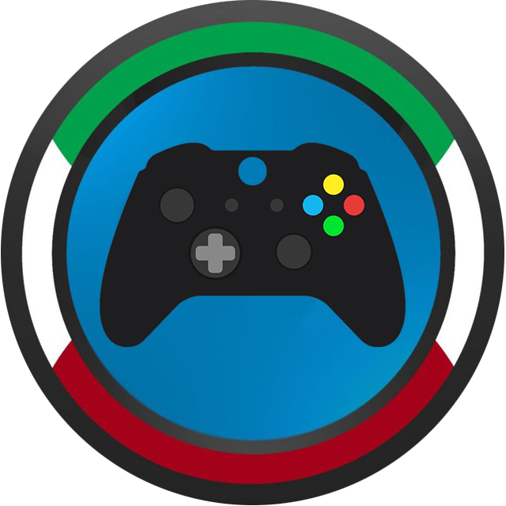

# irotaloclaciditer
<p align="center">
  
</p>

# Descrizione
Progetto per il corso 2020/21 di Reti di Calcolatori, tenuto dal prof. Andrea Vitaletti presso La Sapienza Università di Roma

## Informazioni
GamerVerse è una piattaforma dedicata a coloro che vogliono avvicinarsi o approfondire il mondo dei videogiochi. Grazie alla sua semplicità, è possibile cercare informazioni su qualsiasi gioco, ottenendo varie informazioni al riguardo, tra cui trama, tweets e trailer. È possibile registrarsi sul nostro sito per entrare in contatto con una grande community e condividere le proprie opinioni con altri giocatori.

## Requisiti
I requisiti per la corretta consegna del progetto sono:
- Il servizio REST che implementate (lo chiameremo SERV) deve offrire all'esterno delle API documentate con swagger per esempio
- SERV si deve interfacciare con almeno due servizi REST “esterni”, cioè non su localhost (e.g. google maps)
- Almeno uno dei servizi REST esterni deve essere “commerciale” (es: twitter, google, facebook, pubnub, parse, firbase etc)
- Almeno uno dei servizi REST esterni deve richiedere oauth (e.g. google calendar)
- Si devono usare Websocket e/o AMQP (o simili es MQTT)
- Il progetto deve essere su GIT (GITHUB, GITLAB...) e documentato don un README che illustri almeno scopo del progetto, tecnologie usate, come installarlo, come far girare i casi di test
- Le API REST implementate in SERV devono essere documentate su GIT e devono essere validate con un caso di test

## Tecnologie
* Docker
* Nginx
* Twitter
* Google
* Node.js
* WebSocket
* API IGDB
* API YouTube
* OpenSSL
* OAuth2
## Prerequisiti per il corretto funzionamento
1. Node.js & NPM (Node Package Manager) https://nodejs.org/it/
2. Docker https://docs.docker.com/get-docker/
## (Vecchio) Avvio (Ora siamo più tecnologici :) )
1. Per installare le dipendenze eseguire ``` npm install ```, verranno lette dal file _package.json_ e installate
2. Per avviare il server eseguire ``` npm start ```
# Futuro Avvio
1. Aprire un terminale nella directory del progetto e digitare ```docker build -t gamerverse .```
2. Rimanendo nel terminale, digitare ```docker-compose up -d```
3. Aprire un browser su https://localhost
4. Buona navigazione!

## Api reference
API utilizzata all'interno del progetto:
- [IGDB](https://api-docs.igdb.com/#about): Database di videogiochi su larga scala
- [YouTube] valgono? 
## Documentazione API
**DAVIDE I TEST DELLE API GRAZIE**
## Casi di test
Per ottenere informazioni dettagliate, si consiglia di cercare titoli recenti, come "Call Of Duty" o "GTA"
Registrandosi è possibile chattare con altre persone (utilizzando il login con Twitter o Google)
## Autori
Gamerverse è stato creato da:
- [Marco Collalti](https://github.com/Marco170595)
- [Lorenzo Lancia](https://github.com/LorenzoLancia)
- [Davide Massimei](https://github.com/SpartanDave097)

